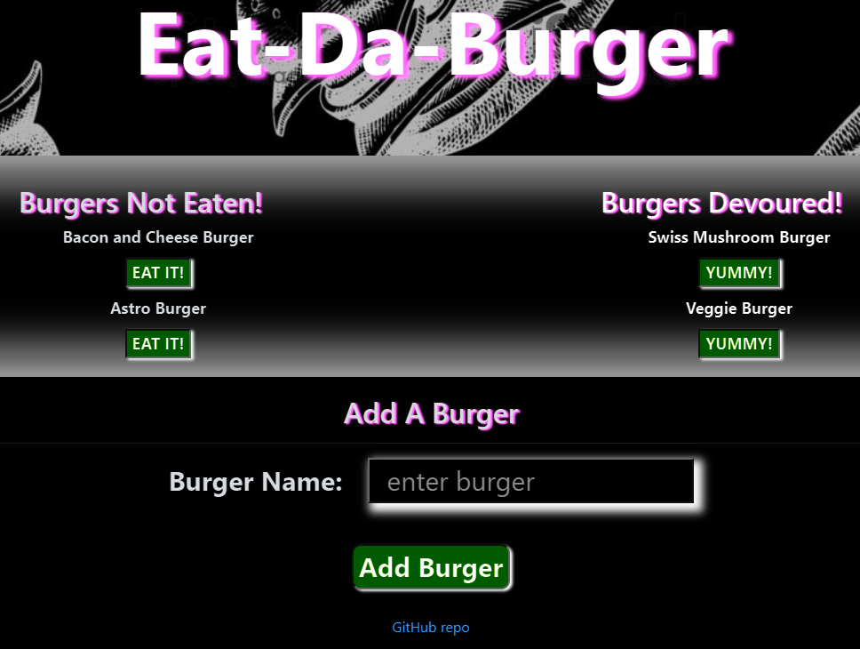

# Eat-Da-Burger
A burger logger with MySQL, Node, Express, Handlebars and a homemade ORM (yum!). Eat-Da-Burger is a restaurant app that lets users input the names of burgers they'd like to eat. Whenever a user submits a burger's name, your app will display the burger on the left side of the page -- waiting to be devoured.

## link to Live Website
The web page app is assessible on the attached link:

https://eat-da-burger2020.herokuapp.com/

## Instructions
To start just click link above, but if access via node server you may need your MySql password added to the connection.js including all the necessary npm application listed below.

The home page is pretty straight forward, just add your favorite burger and click the "Add Burger" button. This will be posted to the "Burgers Not Eaten" section and once you feel peckish just "EAT IT!". Your burger choice will then be posted to the "Burgers Devoured" column.

Every now and then when you feel like having the same burger you had eaten, just click the "YUMMY!" button to bring it back so you don't need to re-type your favorites. Happy munching.

## Technologies Used

- Express Handlebar
- Express.js
- JavaScript
- Bootstrap
- node.js
- jQuery
- MySql
- HTML

Note: this work has been added to my portfolio page in my bio.
[MyPortolio](https://jgohbb.github.io/Portfolio-JGoh/portfolio.html)